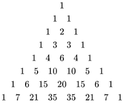
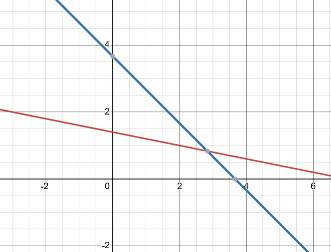

# Algebra

Algebra at its core is made up of <b>terms</b> and <b>expressions</b>.

These are <b>terms</b>:
-	<b>Constant</b>: Value that doesn’t change i.e. 6, 70, -4, ⅘
-	<b>Variable</b>: A value that can change i.e. X, Y, α, ■
-	<b>Coefficient</b>: The constant multiplying a variable i.e. The 6 in 6x, ⅘ in ⁴ˣ⁄₅

<b>Expressions</b> are made of terms and operators. <b>Algebraic expressions</b> are expressions that use variables. <b>Polynomials</b>(poly meaning many) are expressions where every variable has a non-negative whole number as a power. For example, each of these is both an <b>algebraic expression</b> and a <b>polynomial</b>:
-	8α²
-	4x - 2
-	-23y + 9z
-	2x² - 3x - 4

A <b>polynomial function</b> f(x) of one variable x, is one where the power of each variable is a non-negative whole number, and each coefficient is a constant.

The <b>degree</b> of a polynomial refers to the highest power of a variable in the polynomial. The important degrees are:
-	<b>Linear(degree=1)</b>: 4x - 2
-	<b>Quadratic(degree=2)</b>: 2x² - 3x - 4
-	<b>Cubic(degree=3)</b>: x³ - 6x² + 11x - 6
-	<b>Quartic(degree=4)</b>: 3x⁴ - 2x³ + x² + 8

The <b>roots</b> of a polynomial are the values of the variable, when the polynomial = 0 in an equation, for example:
-	For x² - x - 6 = 0, x = -2 & x = 3.

Basic ideas:
-	Like terms with like terms. 
```     
    - Addition and subtraction between terms with the same variable to the same power i.e. 4x² + 6x² = 10x², whereas 4x² + 6x and 4x² + 6y² cannot be simplified.
```
-	Anything done to the one side of an equation is also done to the other. Consider 8x - 3 = 9. We have like terms that can be put together and simplified, namely -3 and 9. To do this, we can add 3 to both sides, following the laws of equality.
```
    8x - 3 = 9.
    8x - 3 + 3 = 9 + 3.
    8x = 12.
```
- Now to get x on its own, we can use the same principle. 8x means x multiplied by 8, so we must simply divide both sides by 8 to get our answer.
```
    x = 12/8.
    x = 4/3.
```
-	All terms can be multiplied/divided together.
```
    - When multiplying terms, all of the coefficients and variables are being multiplied together. For example (4x²)(6y²), is really (4)(x²)(6)(y²). The only multiplication we
        can do is (4)(6) = 24, therefore we get 24x²y² as our result. 
    - When dividing, the easiest method is to write one expression over the other, and divide whatever we can into both the bottom and the top. For example, 12x⁴ / 8y³ becomes 
        4x⁴ / 3y³, by dividing 2 into the top and the bottom. 
    - When multiplying terms with the same variable, we add their powers together. For example (4x²)(6x²), we can simplify (4)(6) to 24, and also (x²)(x²), to x² + 2, to x4. 
        This gives us 24x⁴. Similarly, when dividing we subtract the powers, for example 12x⁴ / 6x³ = 2x.
```
### Expanding brackets: 
-	Multiplication is <b>distributive</b>. This means that when you multiply a term by an expression in brackets i.e. a(b + c), you can get the same answer by multiplying the first term by all terms in the brackets separately. So:
```
    - a(b + c) --> a(b) + a(c), or 
    - 3x(4x² - 6x) --> 3x(4x²) + 3x(-6x)
```
-	When multiplying an expression with another expression, we apply this concept multiple times. For example:
```
    (4x² + 6x)(3x - 4) --> 4x²(3x - 4) + 6x(3x - 4)
    4x²(3x - 4) + 6x(3x - 4) --> 4x²(3x) + 4x²(-4) + 6x(3x) + 6x(-4)
    12x³ - 16x² + 18x - 24x
    12x³ - 16x² - 6x
```
-   When raising an expression with <b>two terms (in brackets) to an exponent</b>, our answer follows the formula Tᵣ₊₁ = (nCr)(xⁿ⁻ʳ)(yʳ). We can use a pattern of increasing/decreasing powers, along with pascals triangle to find our results. For example:
```
    - (a + b)² --> a² + 2ab + b²
    - (a + b)³ --> a³ + 3a²b + 3ab² + b³
    - (a + b)⁴ --> a⁴ + 4a³b + 6a²b² + 4ab³ + b⁴
```
We can see that the exponent of the first variable decreases, the second varicable increases, and the coefficients follow pascals triangle. You can draw this manually:   



Or you can use nCr:
```
    - 2C0 = 1, 2C1 = 2, 2C2 = 1
    - 3C0 = 1, 3C1 = 3, 3C2 = 3, 3C3 = 1
```

### Factorising:
-	Factorising is the opposite of expanding brackets in many ways, where we take a polynomial and revert it to its <b>factors</b>.
-	Finding the <b>Highest Common Factor</b>. When possible, simply removing the HCF is an option. For example:
```
    - 4x + 10 --> 2(x + 5)
    - 5x² + x --> x(5x + 1)
    - 3xy + 6x² --> 3x(y + 2x)
```
-	When factorising quadratic expressions, we can make use of the <b>quadratic formula</b>, gives us the roots of quadratic expressions:


-	The factors of quadratic expressions are generally of the form (ax + b)(cx + d). For example: 
```
    - (x + 2)(x - 3) --> x² - x - 6.
    - (2x + 1)(x + 7) --> 2x² + 15x + 7
```
-	Therefore, when trying to solve an equation which equals 0, we know one of these factors must be equal to 0. Therefore by equating the factors to 0, we find that:
```
    - (x + 2)(x - 3) --> x² - x - 6.
    - x + 2 = 0 --> x = -2
    - x - 3 = 0 --> x = 3
    - For x² - x - 6 = 0, x = -2 & x = 3.
```
-   We can thus apply this method in reverse, using the quadratic formula to find the roots.
-	The <b>difference of two squares</b>. When an expression is in the form 
    a² - b², we know its factors are a + b, and a - b. For example:
```
    - 4x² - 9 = (2x)² - (3)² --> (2x + 3)(2x - 3)
    - 16x⁴ - 1 = (4x2)² - (1)² --> (4x² + 1)(4x² - 1)
    - 4x² - 1 = (2x)² - (1)² --> (2x + 1)(2x - 1)
    - 4x² + 1 = (2x)² - (-1)² --> (2x - 1)(2x + 1)
```
-	The <b>sum of two cubes</b>. When an expression is in the form 
    a³ + b³, we know its factors are a + b, and a² - ab + b². For example:
```
    - 8x³ + 27 = (2x)³ + (3)³ --> (2x + 3)(4x² - 6x + 9)
    - 64x⁶ - 1 = (4x²)³ + (-1)³ --> (4x² - 1)(16x⁴ + 4x² + 1)
```

The <b>factor theorem</b> tells us that any polynomial functions have a factor (x - a), only if f(a) = 0. This can therefore be used to find the roots of equations.

### Simplifying Fractions:
<b>Simplifying Algebraic Fractions</b> can be done in mostly the same way as with normal fractions.
-   For <b>addition and subtraction</b>, find the <b>Lowest Common Multiple</b>, raise everything to the same denominator, and add/subtract as usual.
-   For <b>multiplication</b>, multipy the numerators and denominators as usual.
-   For <b>division</b>, flip the second fraction, and then complete as a multiplication problem.

### Long Division:
<b>Long Division</b> can also be done in the same way as normal long division:
```
            2x² -  x  - 3
           ___________________
    x + 2 | 2x³ + 3x² - 5x - 6
        -  (2x³ + 4x²)
            __________
                  -x² - 5x
                -(-x² - 2x)
                ___________
                      - 3x - 6
                    - (-3x - 6)
                    ___________
                             0
```

### Graphing Equations:
-   An <b>x-intercept</b> is where a graph crosses the x-axis (y=0).
-   A <b>y-intercept</b> is where a graph crosses the y-axis (x=0).

### Solving equations:
Quadratic Equations:
<b>Solving Quadratic equations</b> can be explained as finding the factors (as above) and equating them to zero (in other words, finding the roots).

Simultaneous Equations:
<b>Simultaneous Equations</b> can be solved three ways:
-   Elimination: Multiplying equations by certain numbers to achieve opposite terms on subsequent lines. You can solve equations by using these terms to cancel each other out. Gets more difficult when dealing with high degree polynomials.
```
    - 2x + 5y = 7 
    - 3x - 5x = 4
    -------------
    - 5x = 11
    - x = 11/5
```
-   Substitution: Rearranging equations to substitute variables for each other, to create equations with only variable. Reliable way to solve simultaneous equations, but more long winded. This can be used for equations using more than 2 variables, and higher degree polynomials.
```
    - x + 5y = 7
    - 3x + 3y = 11
    ---------------
    x = 7 - 5y
    ---------------
    3(7 - 5y) + 3y = 11
    21 - 15y + 3y = 11
    -12y = -10
    y = -10/-12
    y = 5/6
```
-   Graphing: Graphing each of the equations, and finding the points where they equate. This can be a simple visual way to solve simultaneous equations, but breaks down in high dimensions.
```
    - x + 5y = 7
    - 3x + 3y = 11
```


