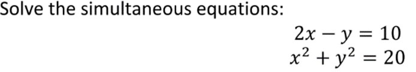

```
(4)² - 2(4) - 8 = 0
16 - 8 - 8 = 0
0 = 0
```

```
(5)² + a(5) + b = 0    (-2)² + a(-2) + b = 0  
25 + 5a + b = 0		    4 - 2a + b = 0		
b = -25 - 5a
			            4 - 2a + (-25 - 5a) = 0
                        4 - 2a - 25 - 5a = 0
                        -21 -7a = 0
                        7a = -21
                        a = -21/7
                        a = -3
b = -25 - 5(-3)
b = -25 + 15
b = -10
Check:
(5)²  - 3(5) - 10 = 0	(-2)² - 3(-2) - 10 = 0
25 - 15 - 10 = 0		4 + 6 - 10 = 0 
0 = 0 			        0 = 0
```

```
a = 5, b = -2, c = -9
x = (-b ± √(b² - 4ac)) / 2a
x = (-(-2) ± √((-2)² - 4(5)(-9))) / 2(5)  
x = (2 ± √(4 + 180)) / 10  
x = (2 ± √184) / 10  
x = (2 ± √4 √46) / 10  
x = (2 ± 2√46) / 10
x = (1 ± √46) / 5
x = (1 ± 6.782) / 5
x = (1 + 6.782) / 5     x = (1 - 6.782) / 5
x = 7.782 / 5           x = (-5.782) / 5
x = 1.556               x = -1.156
```

```
4x + 6 - 3x - 21 = 5x + 1
4x - 3x - 5x = 1 + 21 - 6
- 4x = 16
x = 16 / -4
x = - 4
```

```
a = 4, b = -9, c = 3
x = (-b ± √(b² - 4ac)) / 2a
x = (-(-9) ± √((-9)² - 4(4)(3))) / 2(4)  
x = (9 ± √(81 - 48)) / 8  
x = (9 ± √33) / 8 
x = (9 ± 5.74) / 8  
x = (9 + 5.74) / 8      x = (9 - 5.74) / 8
x = 1.84 x = 0.41
```

```
4(2x + 3) - 7 = 3(x - 5)
8x + 12 - 7 = 3x - 15
5x = -20
x = -20 / 5
x = -4
```

```
2x - y = 10	            x² + y² = 20
y = 2x - 10 	        x² + y² = 20
                        x² + (2x - 10)² = 20
                        x² + (2x - 10)(2x - 10) = 20
                        x² + 4x² - 20x - 20x  + 100 = 20
                        5x² - 40x + 100 = 20
                        x² - 8x + 20 = 4
                        x² - 8x + 16 = 0
		
                        x = (-(-8) ± √((-8)² - 4(1)(16))) / 2(1)  
                        x = (8 ± √(64 - 64)) / 2
                        x = (8 ± 0) / 2
                        x = 8 / 2
                        x = 4
y = 2(4) - 10
y = 8 - 10
y = -2
```

```
2x - y = 7		        x² + y² = 49
y = 2x - 7		        x² + (2x - 7)² = 49
                        x² + (2x - 7)(2x - 7) = 49
                        x² + 4x² - 14x - 14x  + 49 = 49
                        5x² - 28x = 0
                    
                        x = (-(-28) ± √((-28)² - 4(5)(0))) / 2(5)  
                        x = (28 ± √784) / 10
                        x = (28 ± 28) / 2
                        x = 14 ± 14
                        x = 28   x = 0


y = 2(0) - 7            y = 2(28) - 7
y = 0 - 7               y = 56 - 7
y = -7                  y = 49

x = 0, y = -7           x = 28, y = 49
```