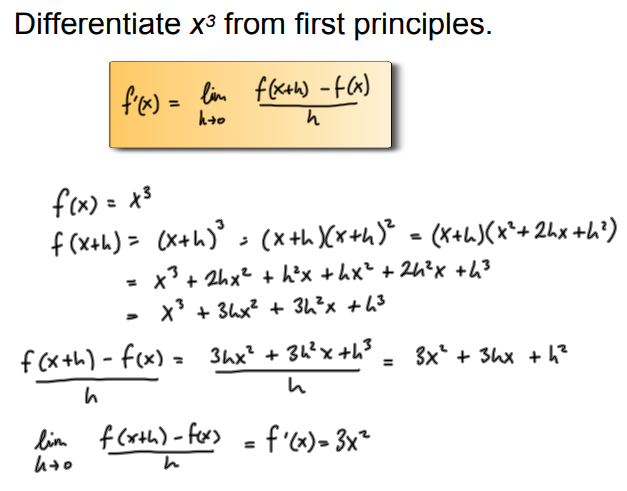

# Differentiation

First Principles(This just has to be learned):

f(x) = 

f(x + h) =

f(x + h) - f(x) =

f(x + h) - f(x) / h =

lim(h --> 0) f(x + h) - f(x) / h =

Standard Differentiation:
x^4 --> 4x