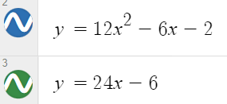

# Differentiation

Uses of differentiation:
- Acceleration
- Minimum/maximum of a function
- Slope of a curve

First Principles(This just has to be learned):

f(x) = 

f(x + h) =

f(x + h) - f(x) =

f(x + h) - f(x) / h =

lim(h --> 0) f(x + h) - f(x) / h =

Standard Differentiation:

Decrease the sign of the 

Chain Rule: 
- Used when you have one function contained within another, you differentiate them both.
- Imagine we have the function f(v). The derivative is f'(v) * v'.
- Consider the inside function as the variable v. Differetiate the main outside function, replacing the inside with v.
- Now, multiply that by the derivative of the inside function.

For example:

- Consider cos(v) the outside function. cos(v) --> -sin(v) --> -sin(2x)
- So we multiply by the derivative of v. 2x --> 2.
- Our answer is -sin(2x) * 2 --> -2sin(2x).

Product Rule:
- Used when differentiating 2 functions multiplied together.
- Imagine we have to differentiate uv. The derivative is uv' + u'v. 

For example:

- When we derive x²sin(x), consider u = x² and v = sin(x), therefore u' = 2x and v' = cos(x)
- So, following the formula, our answer is: x² * cos(x) + sin(x) * 2x --> x²cos(x) + 2xsin(x)

Quotient Rule:
- Used when differentiating 2 functions divided together.
- Imagine we have to differentiate u/v. The derivative is (uv' - u'v) / v². 

For example:

- When we derive x²/sin(x), again consider u = x² and v = sin(x), therefore u' = 2x, v' = cos(x) and v² = sin²(x).
- So, following the formula, our answer is: (x² * cos(x) - sin(x) * 2x)/sin²(x) --> (x²cos(x) + 2xsin(x))/sin²(x).

Rates of change:
- The derivative of a function is the rate of change of that function.
    - A negative value = negative change
    - A positive value = positive change 
    - 0 = turning point

- The second derivative can show us our point of inflection, where the graph changes from concave up to concave down.
    - 2nd derivative is 0 = point of inflection.

In this graph, f = red and f' = blue. Spot that red is rising when blue is positive, falling when blue is negative, and switching when blue is 0.

Now see what you can spot when we differentiate blue to get green:

Now spot green showing the point of inflection:

