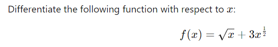
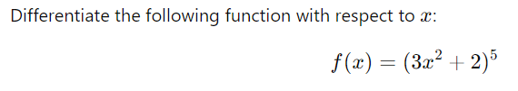
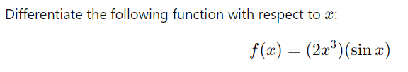
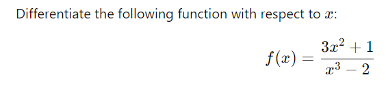
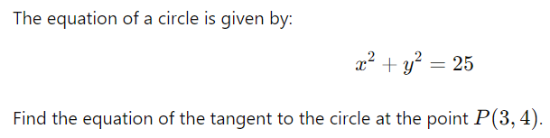

```
√x + 3x^(1/2)
x^(1/2) + 3x^(1/2)
1/2x^(-1/2) + 3/2x^(-1/2)
2(1/(x^(1/2)))
2/(x^(1/2))
2/√x
```

```
(3x² + 2)⁵

u = 3x² + 2         v = w⁵
u' = 6x             v' = 5w⁴

6x * 5(3x² + 2)⁴
30x(3x² + 2)⁴
```

```
2x³(sin x)

u = 2x³             v = sin x
u' = 6x²            v' = cos x

(2x³)(cos x) + (sin x)(6x²)
2x³(cos x) + 6x²(sin x)
```

```
(3x² + 1) / (x³ - 2)

u = 3x² + 1         v = x³ - 2
u' = 6x             v' = 3x²

(x³ - 2)(6x) - (3x² + 1)(3x²) / (x³ - 2)²
(6x⁴ - 12x - 9x⁴ - 3x²) / (x³ - 2)²
(-3x⁴ - 3x² - 12x) / (x³ - 2)²
-3x(x³ + x + 4) / (x³ - 2)²
```

```
x² + xy + y² = 25

x²          xy                  y²
2x          u = x, v = y        u = w², v = y
            u'= 1, v' = y'      u' = 2w, v' = y'
            (1)(y) + (x)(y')    y' * 2y
            y + xy'             2yy'

2x + y + xy' + 2yy' = 0
xy' + 2yy' = -2x - y
y'(x + 2y) = -2x - y
y' = (-2x - y) / (x + 2y)
```

```
x²          y²
2x          u = w², v = y
            u' = 2w, v' = y'
            y' * 2y
            2yy'

2x + 2yy' = 0
x + yy' = 0
yy' = -x
y' = -x / y

slope at (3, 4) --> -3 / 4

y - y1 = m(x - x1)
y - 4 = (-3 / 4)(x - 3)
y - 4 = -3x/4 + 9/4
y = -3x/4 + 25/4
```

For y = x³ - 4x², find where the graph is decreasing.