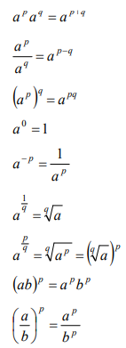
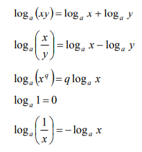
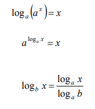
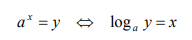

# Logs and Indices

Logs and Indices, in most usages, are used as methods of notating and comparing very large or very small numbers.

## Indices:

- The <b>base</b> of a number in index form is the large, main number. For example, in 8⁶, 8 is the base.
- The <b>index</b>, <b>power</b> or <b>exponent</b> exponent is the number in superscript. For example, in 8⁶, 6 is the exponent.
- An <b>exponential function</b> is a function in the form aˣ, where 'a' is a positive constant. For example, the <b>natural exponential function</b> uses e(euler's number) as the positive constant: eˣ. This comes up a lot, so keep it in mind.

Laws of indices:

For example:
- x² * x³ = x⁵
- x⁵ / x² = x³
- (x²)³ = x⁶, 8ˣ = (2³)ˣ
- x⁰ = 1
- x¹/³ = ∛x
- x⁵/³ = (∛x)⁵
- x⁻⁴ = 1/x⁴
- (xy)³ = x³y³
- (x/y)³ = x³/y³

The laws for surds are just these laws in a different format.
- √a√b = √ab is the same as a¹/²b¹/² = (ab)¹/²
- √a/√b = √(a/b) is the same as (a¹/²)/(b¹/²) = (a/b)¹/²

These rules can be used to rearrange and simplify equations.

Rationalising denominators:
When rationalising denominators, if we cannot simplify the fraction by itself, we usually seek to multiply the denominator.If this is one number, this can be done by multiplying the denominator by itself. For example:
- 5/√5 --> 5/√5 * √5/√5 = 5√5/5 = √5

However, if there 2 terms, we multiply be the <b>conjugate</b>, in order to use the difference of two squares. For example:
- (√2 - √3) / (√2 + √3) --> ((√2 - √3) / (√2 + √3)) * ((√2 - √3) / (√2 - √3)) = (√2 - √3)(√2 - √3) / -1 = -(√2 - √3)(√2 - √3)

Scientific notation:
One of the main uses of indices is for <b>scientific notation</b>. Scientific notation is a way of quantifying very large or very small numbers using a single digit number with decimals for precision, multiplied by 10 raised to an exponent. For example:
- 6.022 × 10²³, is Avogadros constant, the number of particles in one mole of a substance.

## Logs:

Logs are commonly used in scaling natural phenomena.
In a vague sense, Logarithms are the opposite of exponents. For example:

2³ = 8 <--> Log₂ 8 = 3

- The <b>base</b> of a log is the number in subscript. We cannot use a negative base in Logs because they are not always real or defined.
- The <b>natural log</b>, Logₑ, can be written as ln. This again shows up very frequently.
- A <b>logarithmic function</b> is a function in the form Logₐ x, where 'a' is a positive constant.

The laws of Logs are again, essentially the same as the laws for indices.

For example:
- Log₂(16) + Log₂(8) = Log₂(128)
- Log₂(64) - Log₂(16) = Log₂(4)
- Log₂(8³) = 3Log₂(8)
- Log₂(1) = 0
- Log₂(1/2) = -Log₂(2)
- Log₂(2³) = 3
- 2^(Log₂(3)) = 3
- Log₃(4) = Log₂(4)/Log₂(3)

## Logs and Indices:

