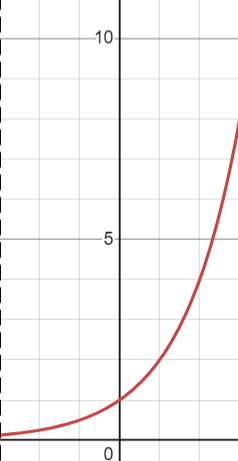
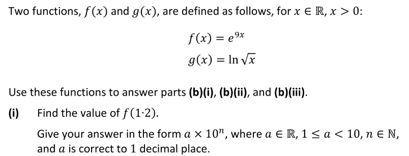
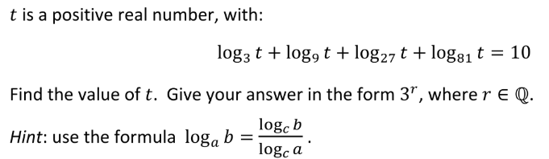
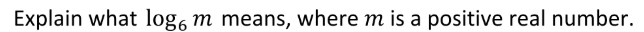
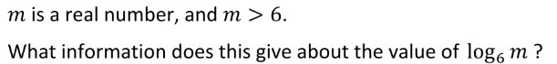
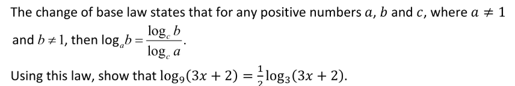

<b>Sketch the graph of the function 𝑓(x)=2ˣ for the range −3≤𝑥≤3.</b>




```
e^(9*1.2)
e^10.8
49021
2.9*10^4
```


```
ln√x = 3.5
√x = e^3.5
(√x)^2 = (e^3.5)^2
x = 3^7
```


```
ln√(e^9x)
ln(e^9x)^1/2
ln(e^9x/2)
9x/2
```


```
Log₃t + Log₉t + Log₂₇t + Log₈₁t = 10
Log₃t + Log₃t/Log₃9 + Log₃t/Log₃27 + Log₃t/Log₃81 = 10
Log₃t + Log₃t/2 + Log₃t/3 + Log₃t/4 = 10
12Log₃t/12 + 6Log₃t/12 + 4Log₃t/12 + 3Log₃t/12 = 120/12
(12Log₃t + 6Log₃t + 4Log₃t + 3Log₃t)/12 = 120/12
25Log₃t/12 = 120/12
25Log₃t = 120
Log₃t = 120/25
Log₃t = 24/5
3^24/5
```


```
What power do you need to raise 6 to, to get m.
```


```
Log₆6 is 1, so our answer is equal to or above 1.
```


```
Log₉(3x + 2)
Log₃(3x + 2)/Log₃(9)
Log₃(3x + 2)/2
1/2(Log₃(3x + 2))
```


```
1/2(Log₃(3x + 2)) = Log₃(x + 1)
Log₃(√(3x + 2)) = Log₃(x + 1)
√(3x + 2) = x + 1
3x + 2 = (x + 1)²
3x + 2 = x² + 2x + 1
x² - x - 1 = 0
x = (-(1) +- √((-1)² - 4(1)(-1))) / 2(1)
x = (-1 +- √5) / 2
```