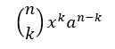
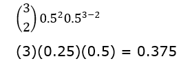

# Probability

## Counting
In each trial, the number of <b>possible outcomes</b> is the number of outcomes of each parts of the trial <b>multiplied</b> together.
- If the three parts of a trial has probabilities M, N and O, the probability of the whole trial is M * N * O.
- A die and a coin being tossed have 6 x 2 = 12 possible outcomes.
```
    1,H	    1,T
    2,H 	2,T
    3,H 	3,T
    4,H 	4,T
    5,H 	5,T
    6,H 	6,T
```
- Two dice and a coin being tossed have 6 * 6 * 2 = 72 possible outcomes.

## Arrangements/Permutations
If we want to <b>arrange</b> a number of different objects, for example, the letters ABCDEF, the possible outcomes to be multiplied together would be 6 * 5 * 4 * 3 * 2 * 1 = 720.  When picking out our first letter, we have 6 possible outcomes. For our next letter we then have 5 choices left, and so on. This pattern 6 * 5 * 4 * 3 * 2 * 1 is known as a <b>factorial</b>, and is written like 6!. For example:
- Arranging the letters in ABC = 3! = 3 * 2 * 1 = 6.
- Arranging the letters in ORDER = 5! = 5 * 4 * 3 * 2 * 1 = 120.
If we have the same object appearing multiple times, for example:
- In the word "fActoriAl", we <b>divide</b> the factorial of the all the objects by the number of repeated ones. So we get: 9! / 2! or (9 * 8 * 7 * 6 * 5 * 4 * 3 * 2 * 1 ) / (2 * 1) = 181,440 .
- In the word "ARRAnge", we must divide by multiple values, and multiply these values together. So we get: 7! / (2!)(2!) or (7 * 6 * 5 * 4 * 3 * 2 * 1) / (2 * 1 * 2 * 1) = 1260.
- In the word "pArALLeL", we get: 8! / (3!)(2!) or (8 * 7 * 6 * 5 * 4 * 3 * 2 * 1) / (3 * 2 * 1 * 2 * 1) = 3360.

## Experiments
Probability is measured in <b>percent</b> or in <b>fractions between 0 and 1</b>. 
- A <b>trial</b> is a single act done in one experiment, like a coin toss or rolling a die.
- An <b>outcome</b> is the result of a trial, such as a coin landing on heads.
- An <b>event</b> is the occurrence of one or more outcomes, such as landing on heads and rolling a one.
- When we do an experiment, such as seeing how many times you get  heads in a coin toss, we call our result the <b>experimental probability</b> or the <b>relative frequency</b>. The more trials we do, the more accurate the experimental probability will become.
- A <b>sample space</b> is the list of all possible outcomes of the trial.
- Generally speaking, when we want the probability of one event <b>and</b> another event we <b>multiply</b>. When we want the probability of one event <b>or</b> another event we <b>add</b>.
- Events are known as <b>mutually exclusive</b> if they cannot occur at the same time, such as a coin landing on heads and tails.

## Expected Value
A <b>probability distribution</b> is a list of all possible outcomes of an experiment or scenario, along with the probability of each of those outcomes occurring. For example: 
	In an experiment when we flip a coin 3 times, the probability distribution is:
```
HHH HHT	HTH	HTT	THH	THT	TTH	TTT
1/8	1/8	1/8	1/8	1/8	1/8	1/8	1/8
```
or:

0 Heads	1 Heads	2 Heads	3 Heads
1/8	3/8	3/8	1/8

The <b>expected value</b> is used in estimating the probable average between a number of outcomes. We can work out the expected value is the <b>sum of each outcome multiplied by the probability of that outcome occurring</b>. For example:
- In an experiment when we flip a coin 3 times, the expected value for getting heads is:
```
    (0)(1/8) + (1)(3/8) + (2)(3/8) + (3)(1/8)
    (3/8) + (6/8) + (3/8)
    12/8 = 3/2 = 1.5
```

## Bernoulli
If we have a trial we repeat over and over that can only end in success or failure, we can use the binomial formula to calculate the probability of a certain number of successes occurring. Each individual trial here is called a Bernoulli Trial. The binomial formula is:



- n = number of trials
- x = probability of success
- a = probability of failure (1-x)
- k = number of successes
For example, if we flip a coin 3 times, the probability of getting heads twice is:

