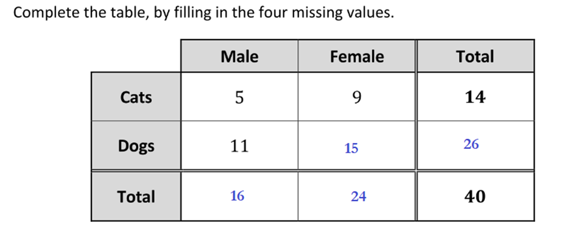
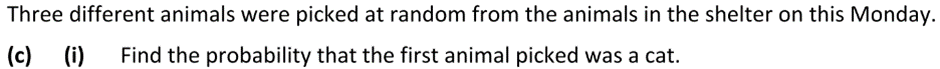
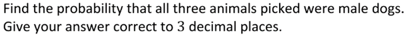
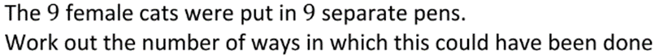
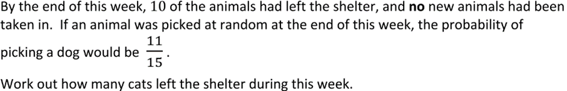
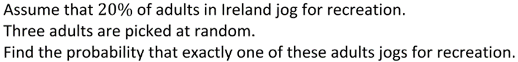
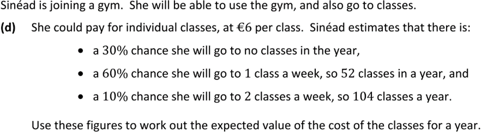

14/40 = 7/20

(11/40)(10/39)(9/38) = 990/59280 = 33/1976 = 0.017

9! = 9 * 8 * 7 * 6 * 5 * 4 * 3 * 2 * 1 = 362880

30 animals
11/15 dogs --> 22/30 dogs 
26 - 22 = 4 dogs left the shelter
10 - 4 = 6 cats left the shelter

(4/5)(4/5)(1/5)(3) = 48/125

(3/10 * 0) + (6/10 * 52) + (1/10 * 104)
(312/10) + (104/10)
416/10 = 41.6 classes
41.6 * €6 = €249.60
